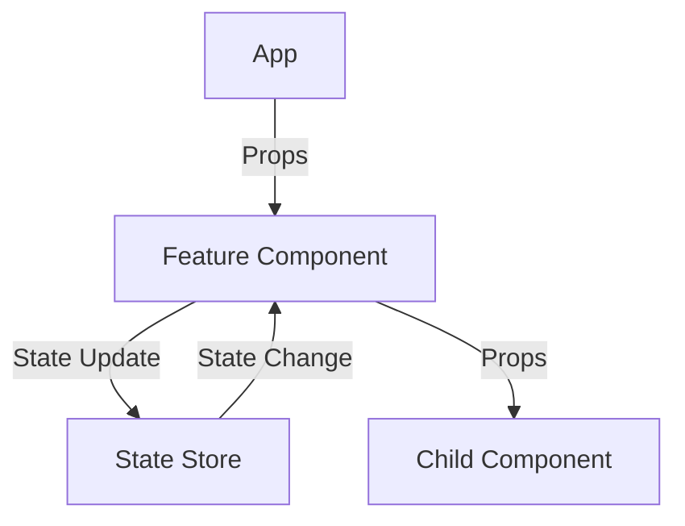
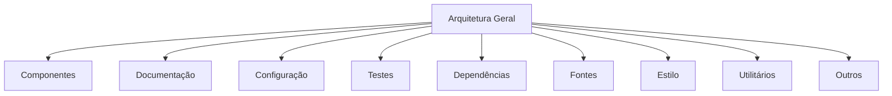
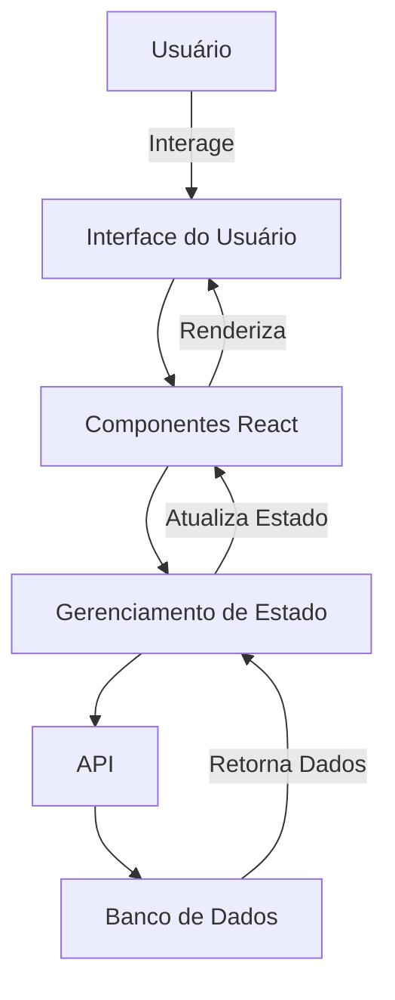
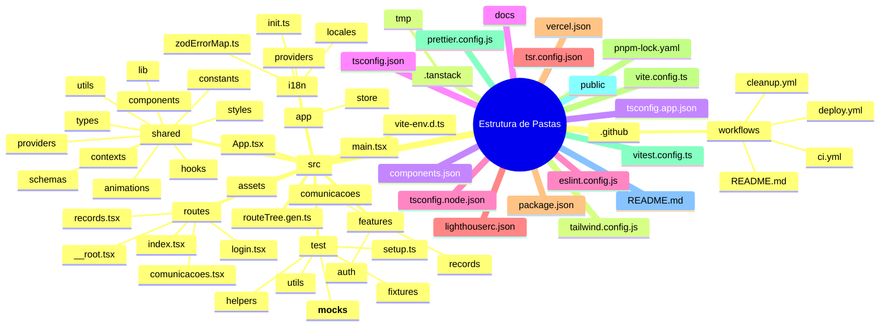

```markdown
# Documentação de Arquitetura - Frontend

**Gerado em:** 2025-08-11T14:06:39.530Z  
**Projeto:** Frontend  
**Tipo:** Frontend  

## Tecnologias Utilizadas

- **React:** Biblioteca para construção de interfaces de usuário.
- **TypeScript:** Superset do JavaScript que adiciona tipagem estática.
- **Tailwind CSS:** Framework CSS utilitário para estilização rápida e responsiva.
- **Vite:** Ferramenta de construção e desenvolvimento que oferece um ambiente de desenvolvimento rápido.

## Estrutura do Projeto

```
├── .github (4 arquivos)
│   └── workflows (4 arquivos)
│       ├── ci.yml
│       ├── cleanup.yml
│       ├── deploy.yml
│       └── README.md
├── .tanstack (0 arquivos)
│   └── tmp (0 arquivos)
├── components.json
├── docs (0 arquivos)
├── eslint.config.js
├── lighthouserc.json
├── package.json
├── pnpm-lock.yaml
├── prettier.config.js
├── public (2 arquivos)
├── README.md
├── src (173 arquivos)
│   ├── app (7 arquivos)
│   │   ├── providers (4 arquivos)
│   │   └── store (3 arquivos)
│   ├── App.tsx
│   ├── assets (4 arquivos)
│   ├── features (48 arquivos)
│   │   ├── auth (4 arquivos)
│   │   ├── comunicacoes (27 arquivos)
│   │   └── records (17 arquivos)
│   ├── i18n (6 arquivos)
│   │   ├── init.ts
│   │   ├── locales (4 arquivos)
│   │   └── zodErrorMap.ts
│   ├── main.tsx
│   ├── routes (5 arquivos)
│   │   ├── comunicacoes.tsx
│   │   ├── index.tsx
│   │   ├── login.tsx
│   │   ├── records.tsx
│   │   └── __root.tsx
│   ├── routeTree.gen.ts
│   ├── shared (90 arquivos)
│   │   ├── animations (6 arquivos)
│   │   ├── components (60 arquivos)
│   │   ├── constants (2 arquivos)
│   │   ├── contexts (1 arquivo)
│   │   ├── hooks (6 arquivos)
│   │   ├── lib (9 arquivos)
│   │   ├── providers (2 arquivos)
│   │   ├── schemas (1 arquivo)
│   │   ├── styles (1 arquivo)
│   │   ├── types (1 arquivo)
│   │   └── utils (1 arquivo)
│   ├── test (8 arquivos)
│   │   ├── fixtures (1 arquivo)
│   │   ├── helpers (1 arquivo)
│   │   ├── setup.ts
│   │   ├── utils (3 arquivos)
│   │   └── __mocks__ (2 arquivos)
│   └── vite-env.d.ts
├── tailwind.config.js
├── tsconfig.app.json
├── tsconfig.json
├── tsconfig.node.json
├── tsr.config.json
├── vercel.json
├── vite.config.ts
└── vitest.config.ts
```

## Análise da Estrutura de Pastas

### `.github`
**Propósito:** Contém arquivos de configuração para integração contínua e automação de workflows.  
**Arquivos:** 4

### `.tanstack`
**Propósito:** Diretório temporário para arquivos relacionados ao TanStack.  
**Arquivos:** 0

### `docs`
**Propósito:** Diretório destinado à documentação do projeto.  
**Arquivos:** 0

### `public`
**Propósito:** Contém arquivos estáticos públicos, como imagens e ícones.  
**Arquivos:** 2

### `src`
**Propósito:** Contém o código-fonte do projeto.  
**Arquivos:** 173

### `src/app`
**Propósito:** Contém a lógica de aplicação, incluindo provedores e gerenciamento de estado.  
**Arquivos:** 7

### `src/features`
**Propósito:** Contém funcionalidades específicas do aplicativo, organizadas por domínio.  
**Arquivos:** 48

### `src/shared`
**Propósito:** Contém componentes reutilizáveis, animações, estilos e utilitários.  
**Arquivos:** 90

### `src/test`
**Propósito:** Contém arquivos de teste, incluindo mocks e utilitários de teste.  
**Arquivos:** 8

## Dependências Críticas

### Framework
- `react`: Biblioteca principal para construção de interfaces.
- `@tanstack/react-query`: Gerenciamento de estado assíncrono.
- `@tanstack/react-router`: Gerenciamento de rotas.

### UI
- `tailwindcss`: Framework CSS para estilização.

### Testing
- `@testing-library/react`: Ferramenta para testes de componentes React.

## Padrões Arquiteturais

- **Componentização:** O projeto é estruturado em componentes reutilizáveis, permitindo uma manutenção mais fácil e uma melhor organização do código.
- **Gerenciamento de Estado:** Utiliza `zustand` para gerenciamento de estado, proporcionando uma abordagem simples e eficaz.
- **Internacionalização:** Implementação de `i18next` para suporte a múltiplos idiomas.

## Fluxo de Dados entre Componentes

O fluxo de dados no aplicativo segue um padrão unidirecional, onde os dados são passados de componentes pais para filhos através de props. O estado global é gerenciado pelo `zustand`, permitindo que componentes em diferentes níveis da árvore de componentes acessem e atualizem o estado conforme necessário.



## Decisões de Design

- **Uso de TypeScript:** A escolha de TypeScript permite uma melhor verificação de tipos e ajuda a evitar erros comuns durante o desenvolvimento.
- **Estilização com Tailwind CSS:** A utilização de Tailwind CSS proporciona uma abordagem rápida e flexível para estilização, permitindo a criação de interfaces responsivas com facilidade.

## Seção de Performance

Para otimizar a performance do aplicativo, foram implementadas as seguintes práticas:
- **Lazy Loading:** Componentes são carregados sob demanda, reduzindo o tempo de carregamento inicial.
- **Memoização:** Uso de `React.memo` e `useMemo` para evitar renderizações desnecessárias.

## Pontos de Extensão

O projeto foi estruturado para facilitar extensões futuras:
- **Novas Funcionalidades:** Novas funcionalidades podem ser adicionadas como novos diretórios dentro de `src/features`.
- **Componentes Reutilizáveis:** Novos componentes podem ser adicionados ao diretório `src/shared/components`, seguindo as convenções de nomenclatura existentes.

---
*Gerado automaticamente pelo Documentation Generator*
```
## Diagrams






