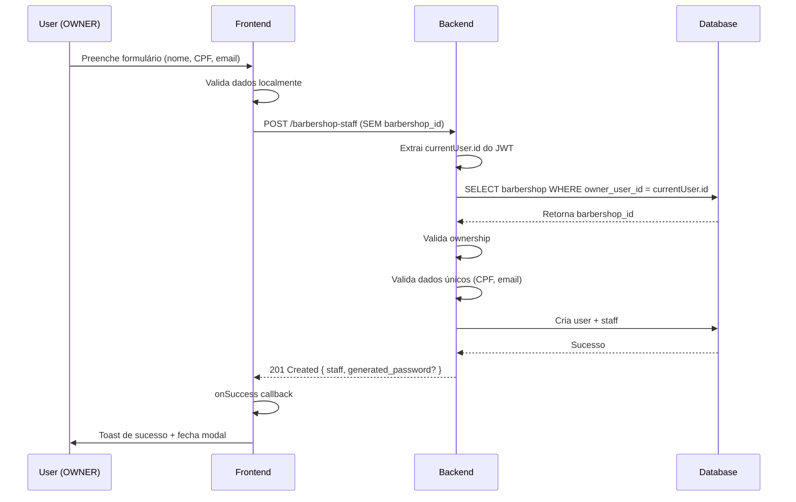

# 🎯 Solução: Inferência Automática do barbershop_id

## 📋 Contexto do Problema

### Situação Inicial

- **Frontend**: Tentava usar `user.id` como `barbershop_id` (INCORRETO ❌)
- **Backend**: Exigia `barbershop_id` obrigatório no payload
- **Problema**: `user.id` ≠ `barbershop_id`
  - JWT `currentUser` contém apenas: `{id, role, status}`
  - Não inclui `barbershop_id`

### Requisitos do Sistema

1. Um usuário OWNER pode ter **apenas 1 barbearia**
2. Um usuário **não pode** ser STAFF e OWNER simultaneamente (precisa de contas separadas)
3. Quando OWNER acessa `/barbershop-staff`, quer gerenciar staff **da sua própria barbearia**

## 🔧 Solução Implementada

### Estratégia: Backend Infere Automaticamente

**Vantagens:**

- ✅ Mais simples para o frontend
- ✅ Mais seguro (backend valida ownership)
- ✅ Menos código duplicado
- ✅ Melhor UX (menos campos no formulário)

---

## 📝 Mudanças no Backend

### 1. **Model Schema** (`barbershop-staff.models.ts`)

```typescript
// ANTES
barbershop_id: z.string().min(1, "ID da barbearia é obrigatório"),

// DEPOIS
barbershop_id: z.string().min(1, "ID da barbearia é obrigatório").optional(),
```

**Razão:** `barbershop_id` agora é opcional - será inferido automaticamente.

---

### 2. **Service** (`barbershop-staff.service.ts`)

```typescript
async createStaff(
  request: CreateStaffRequest,
  currentUserId: string,
  currentUserRole: string
): Promise<CreateStaffResponse> {
  const validatedRequest = createStaffSchema.parse(request);

  // 🎯 NOVA LÓGICA: Inferir barbershop_id se não fornecido
  let barbershopId = validatedRequest.barbershop_id;

  if (!barbershopId) {
    // Buscar barbearia do owner logado
    const userBarbershop = await this.prismaSafe.safeExecute(async (prisma) => {
      return await prisma.barbershop.findFirst({
        where: { owner_user_id: currentUserId },
        select: { id: true },
      });
    });

    if (!userBarbershop) {
      throw new NotFoundError(
        "Nenhuma barbearia encontrada para este usuário. Apenas proprietários de barbearias podem adicionar funcionários."
      );
    }

    barbershopId = userBarbershop.id;
  }

  // Verificar acesso à barbearia
  await this.checkBarbershopAccess(
    barbershopId,
    currentUserId,
    currentUserRole
  );

  // ... resto do código usa barbershopId
}
```

**Lógica:**

1. Tenta usar `barbershop_id` do payload (se enviado)
2. Se não enviado, busca barbearia onde `owner_user_id = currentUserId`
3. Valida que o usuário é OWNER desta barbearia
4. Usa o `barbershopId` inferido em todo o resto do código

**Atualizações de referências:**

- Todas as menções a `validatedRequest.barbershop_id` foram substituídas por `barbershopId`
- Verificações de staff existente
- Verificações de exclusividade
- Criação do registro de staff

---

### 3. **Controller** (`barbershop-staff.controller.ts`)

```typescript
async createStaff(request: FastifyRequest, reply: FastifyReply) {
  const validatedData = createStaffSchema.parse(request.body);
  const { currentUser } = request as any;

  const result = await this.staffService.createStaff(
    validatedData,
    currentUser.id,
    currentUser.role
  );

  return reply.code(201).send(result);
}
```

**Sem mudanças:** Controller continua passando `validatedData` diretamente - o service cuida da inferência.

---

## 📝 Mudanças no Frontend

### 1. **Hook** (`useBarbershopStaffCreate.ts`)

```typescript
// ANTES
const { user } = useAuth();
const barbershop_id = user?.id; // ❌ ERRADO
const payload = {
  barbershop_id, // ❌ user.id não é barbershop_id
  user: { ... },
  ...
};

// DEPOIS
// ✅ Não precisamos mais do useAuth
const payload = {
  // barbershop_id removido - backend infere automaticamente
  user: {
    first_name: data.first_name,
    last_name: data.last_name || "",
    cpf: data.cpf,
    email: data.email || "",
  },
  role_in_shop: "BARBER" as const,
  status: data.status || "ACTIVE",
  is_available: true,
};
```

**Mudanças:**

- ✅ Removido import de `useAuth` (não usado mais)
- ✅ Removido linha `const { user } = useAuth();`
- ✅ Removido `barbershop_id` do payload
- ✅ Backend agora infere automaticamente

---

### 2. **Schema** (`barbershop-staff.schemas.ts`)

```typescript
// Type para dados mínimos de criação
export type CreateStaffMinimalData = {
  first_name: string;
  last_name?: string;
  cpf: string;
  email?: string;
  status?: StaffStatus;
  // barbershop_id removido ✅
};
```

**Sem mudanças necessárias:** O tipo já não incluía `barbershop_id`.

---

### 3. **Modal** (`CreateStaffModal.tsx`)

```typescript
const { createStaff, isLoading } = useBarbershopStaffCreate({
  onSuccess: () => {
    // ✅ Modal só fecha quando sucesso confirmado
    onClose();
  },
});

const onSubmit = async (data: CreateStaffMinimalFormData) => {
  // Split nome completo
  const nameParts = data.full_name.trim().split(" ");
  const first_name = nameParts[0];
  const last_name = nameParts.slice(1).join(" ") || undefined;

  // Criar staff com dados transformados
  // ✅ Modal NÃO fecha aqui - espera onSuccess
  createStaff({
    first_name,
    last_name,
    cpf: data.cpf,
    email: data.email?.trim() || undefined,
    status: "ACTIVE",
  });
  // ⚠️ NÃO chamar onClose() aqui!
};
```

**Error Handling Implementado:**

- ✅ Modal **não** fecha no `onSubmit`
- ✅ Modal **só** fecha no callback `onSuccess` do mutation
- ✅ Se houver erro, modal permanece aberta
- ✅ Usuário pode ver erros e corrigir dados

---

## 🔒 Validações de Segurança

### Backend

1. **Verifica Ownership:**

   ```typescript
   await this.checkBarbershopAccess(
     barbershopId,
     currentUserId,
     currentUserRole,
   );
   ```

   - Garante que `currentUserId` é o `owner_user_id` da barbearia
   - Ou que `currentUserRole === "SUPER_ADMIN"`

2. **Valida Existência:**

   ```typescript
   if (!userBarbershop) {
     throw new NotFoundError(
       "Nenhuma barbearia encontrada para este usuário. Apenas proprietários de barbearias podem adicionar funcionários.",
     );
   }
   ```

3. **Previne Duplicação:**
   - Verifica se usuário já é staff desta barbearia
   - Verifica se usuário é staff de outra barbearia (exclusividade)

---

## 📊 Fluxo Completo



---

## ✅ Testes Necessários

### Cenários de Sucesso

1. ✅ Criar staff **com** email → gera senha automática
2. ✅ Criar staff **sem** email → apenas entrada de staff
3. ✅ Validação de CPF (formato, dígitos verificadores)
4. ✅ Modal fecha apenas após sucesso confirmado

### Cenários de Erro

1. ❌ CPF inválido → modal permanece aberta, exibe erro
2. ❌ CPF duplicado → modal permanece aberta, exibe erro
3. ❌ Email duplicado → modal permanece aberta, exibe erro
4. ❌ Usuário já é staff → modal permanece aberta, exibe erro
5. ❌ Usuário não é OWNER → backend retorna 403 Forbidden

### Casos de Borda

1. 🔍 Usuário sem barbearia → "Nenhuma barbearia encontrada"
2. 🔍 Barbearia inativa → "Não é possível adicionar funcionários"
3. 🔍 SUPER_ADMIN pode enviar `barbershop_id` específico

---

## 📦 Arquivos Modificados

### Backend

- ✅ `api-b-boss-club/src/features/barbershop-staff/models/barbershop-staff.models.ts`
- ✅ `api-b-boss-club/src/features/barbershop-staff/services/barbershop-staff.service.ts`

### Frontend

- ✅ `web-b-boss-club/src/features/barbershop-staff/hooks/useBarbershopStaffCreate.ts`

### Documentação

- ✅ `web-b-boss-club/src/features/barbershop-staff/docs/BARBERSHOP_ID_INFERENCE_SOLUTION.md` (este arquivo)

---

## 🚀 Próximos Passos

1. **Teste Manual:**
   - Iniciar backend: `cd api-b-boss-club && pnpm dev`
   - Iniciar frontend: `cd web-b-boss-club && pnpm dev`
   - Fazer login como OWNER
   - Acessar `/barbershop-staff`
   - Clicar em "Adicionar novo"
   - Testar cenários de sucesso e erro

2. **Fase 2 (Futuro):**
   - Adicionar campo de telefone
   - Adicionar seletor de status
   - Adicionar campos avançados (salário, comissão)

---

## 🎓 Lições Aprendidas

1. **JWT Payload**: `currentUser` não contém `barbershop_id`
   - Solução: Backend infere via relação `owner_user_id`

2. **Database Relationships**:
   - User → owned_barbershops[] (1:N)
   - User → staff_entries[] (1:N)
   - Complexidade: Um user pode ser OWNER ou STAFF, mas não ambos

3. **Error Handling em Modals**:
   - Modal não deve fechar no `onSubmit`
   - Modal só fecha no `onSuccess` callback
   - Permite usuário ver e corrigir erros

4. **Backend vs Frontend Responsibilities**:
   - Backend: Validações de segurança, inferência de dados
   - Frontend: UX, validação de formato, feedback ao usuário

---

**Status:** ✅ Implementado e pronto para testes  
**Data:** 03/10/2025  
**Versão:** 1.0
